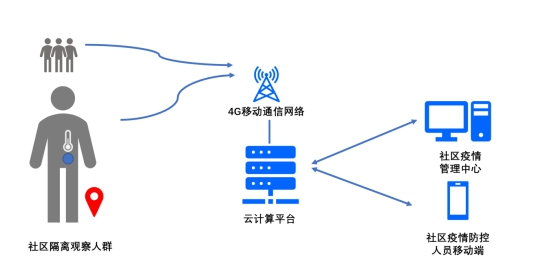
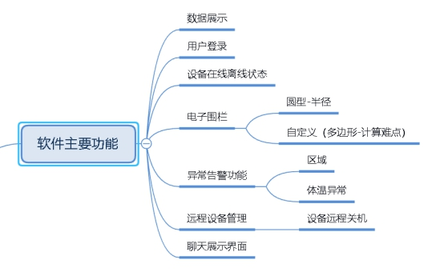
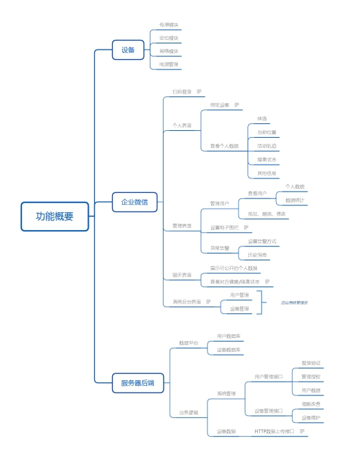

# 一、软件简介

本社区疫情防控助手软件旨在配合本公司研发的无线体温监测设备，实时对个人进行体温的实时监测，帮助社区打造疫情防控体系，通过腾讯微信迅速无误的无接触登记身份信息，建立个人信息与健康管理档案。利用物联网技术和大数据技术，数字化收集与管理隔离人员体温数据数据。通过移动通讯网络，进行隔离人员定位及运动轨迹跟踪，防止人员非法迈出管理区域。利用云服务平台，进行体温与运动轨迹大数据的收集，采用大数据分析技术，实时发现感染人群，并追踪感染人群的运动轨迹，以及查找与感染者密切接触人员，进行有效管控。通本社区疫情防控助手软件，实时通知防控人员与感染人群，提升防控人员与社区人群的沟通效率，降低人群交叉感染的风险。

 

# 二、软件功能

本软件主要应用场景是在企业或者地方区域，用于实时监测该区域的所有用户的体温状态，监测近期的体温变化，达到疫情防控的作用。

软件主要分为三个页面：首页，地图，设置页面。

首页扫一扫功能，根据设备状态来判断该设备处于绑定还是解绑状态，点击使用扫一扫对用户进行信息绑定，实时追踪地理位置，监测体温变化，如有异常会立即发出告警，在管理平台进行反馈，再实施隔离。同时扫一扫的另一个功能，是对已经隔离结束，体温连续十四天未出现异常的用户进行解绑操作。同时扫一扫还可以在扫描用户携带设备查看用户详细信息。

地图展示所有用户最新位置信息，查看概览，直观的展示用户状态，分别有在线正常状态，离线状态，体温异常状态，实时查看各个用户的详细信息，体温变化，近期活动轨迹等。

设置页面用于管理企业区域，设置电子围栏功能管理员可以设置指定区域，设置区域大小，来进行对用户的管理。为用户解绑围栏，当用户连续体温正常满足解绑条件，即可为用户解绑用户围栏，用户出现不再受限制。

## **1.** 软件主要功能

 

## **2.** 功能概览

